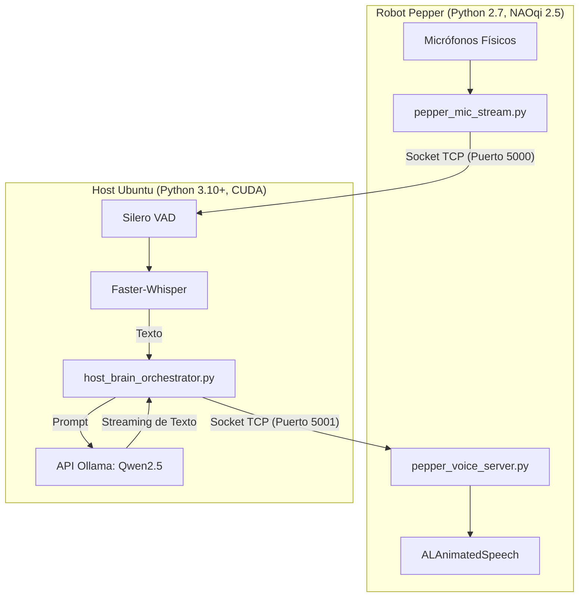

# Pepper Remote Brain Architecture
> **Revitalizando a Pepper (NAOqi 2.5) con Inteligencia Artificial Moderna Distribuida (CUDA, Whisper & Qwen2.5)**


## Arquitectura del Sistema
El sistema delega todo el procesamiento cognitivo pesado a un Host local con aceleración CUDA, resolviendo las limitaciones de hardware del robot sin intervenir su vida autónoma (ALAutonomousLife). El Host y el Robot se comunican mediante Sockets TCP bidireccionales, gestionando micrófonos y síntesis de voz en paralelo con un robusto protocolo **Anti-Eco**.



## Metodología y Funcionamiento Interno

Este proyecto implementa el concepto de **"Cerebro Remoto"** (Remote Brain Philosophy). Debido a las limitaciones de hardware de la plataforma Pepper v1.7 (procesador Intel Atom legado y entorno cerrado en Python 2.7 / NAOqi 2.5), externalizamos toda la carga cognitiva a un PC Host equipado con aceleración por hardware (NVIDIA CUDA). 

A continuación, se detalla la metodología científica y el protocolo de ingeniería implementado para lograr una comunicación bidireccional asíncrona, en tiempo real y con latencia ultrabaja.

---

### 1. ¿Cómo Escucha Pepper? (Oído y Captura Asíncrona)
El flujo de captura de audio se gestiona en `pepper_mic_stream.py` y se fundamenta en tres pilares:

*   **Liberación de Conflictos de Hardware (Pre-flight Cleanup):**
    En NAOqi, el acceso al micrófono físico (`ALAudioDevice`) es exclusivo. Motores internos nativos como `ALDialog` (sistema de diálogos nativo) y `ALSpeechRecognition` (ASR nativo) bloquean el canal. Si un script externo intenta registrarse sin liberarlos, el callback de audio recibirá buffers vacíos (**0 bytes**). Nuestro script soluciona esto ejecutando `pre_flight_cleanup()`, el cual desuscribe y pausa activamente a `ALDialog` y `ALSpeechRecognition` antes de levantar nuestro stream.
    
*   **Configuración del Stream de Audio Nativo:**
    Nos registramos ante `ALAudioDevice` utilizando la API de bajo nivel `setClientPreferences` con los siguientes parámetros:
    *   `sampleRate = 16000 Hz`: Frecuencia de muestreo estándar de la industria y óptima para modelos modernos de reconocimiento del habla (ASR/STT) como Faster-Whisper.
    *   `channelFlag = 3 (FRONT_MIC)`: Captura exclusiva del micrófono frontal de la cabeza del robot. Esto aísla ruidos procedentes de los servomotores de la base y las articulaciones.
    *   `deinterleaved = 0 (Interleaved)`: Los datos PCM se envían en formato raw sin de-interlinear, listos para ser transmitidos.

*   **Arquitectura Desacoplada (Producer/Consumer):**
    El callback nativo de NAOqi `processRemote()` se ejecuta en un hilo de tiempo real crítico dentro del Core de C++ del robot. Si este hilo se bloquea intentando transmitir los bytes por la red TCP, la sincronización interna de NAOqi se rompe y el broker sufre un crash inmediato. 
    Para evitar esto, implementamos una cola asíncrona thread-safe (`Queue.Queue`):
    *   **Productor (`processRemote`)**: Recibe el búfer de bytes PCM crudos y lo inserta de inmediato en la cola usando `put_nowait()`, liberando el hilo de NAOqi en microsegundos.
    *   **Consumidor (`_network_loop`)**: Un hilo asíncrono independiente (`network_thread`) extrae de forma segura los bloques de audio de la cola y los transmite a través del socket TCP (Puerto 5000) hacia el Host.

---

### 2. ¿Cómo Habla Pepper? (Boca, Prosodia y Gesticulación)
La síntesis y expresión corporal se controlan en `pepper_voice_server.py` mediante la integración de animaciones y voz modificada:

*   **Ajuste Estético y Voz Juvenil ("Aniñada"):**
    La voz por defecto de Pepper suele percibirse como monótona y excesivamente robótica. Modificamos su comportamiento a través de dos niveles:
    1.  **Parámetros TTS Nativo:** En `ALTextToSpeech` forzamos el idioma a `"Spanish"` y aumentamos el tono mediante `pitchShift = 1.2` para darle una identidad vocal más juvenil y amigable.
    2.  **Etiquetas Dinámicas de Prosodia (Nuance TTS):** Antes de enviar el texto al motor de habla, inyectamos etiquetas dinámicas de control de voz:
        *   `\\vct=115\\`: Modifica el control de tono (Voice Control) al 115%, acentuando la estética alegre.
        *   `\\rspd=85\\`: Reduce la velocidad de habla (Rate of Speed) al 85%, obligando al robot a pronunciar con perfecta dicción y a respetar los signos de puntuación, evitando solapamientos ininteligibles.

*   **Lenguaje Corporal Contextual (`ALSpeakingMovement`):**
    No basta con reproducir audio; Pepper es un robot social. Activamos el servicio `ALSpeakingMovement` configurado en modo `"contextual"`. Esto permite que el robot analice lingüísticamente la estructura sintáctica de la frase que está verbalizando y asigne automáticamente gesticulaciones corporales en sus brazos, manos y cabeza en perfecta sincronización con el ritmo de su voz.

---

### 3. Transmisión del Audio Crudo, VAD y Protocolo Anti-Eco
La coordinación del flujo y el tratamiento de señales de audio se realiza en el Host (`host_brain_orchestrator.py`):

*   **Tratamiento de Señal y Endianness:**
    El procesador Intel Atom de Pepper (arquitectura x86 de 32 bits) y la arquitectura del Host (x86_64) comparten el ordenamiento de bytes **Little-Endian (LE)**. Gracias a esta compatibilidad nativa, el flujo de bytes crudos `int16` recibido por el socket no requiere transformaciones de bytes complejas ni reordenamientos en el host. Simplemente interpretamos los bytes recibidos usando NumPy: `np.frombuffer(raw_data, dtype=np.int16)` y los normalizamos a `float32` dividiendo por `32768.0` para alimentar a Whisper.

*   **Filtro de Ruido Mecánico (VAD por Umbral RMS):**
    Pepper posee ventiladores internos activos en su cabeza para enfriar sus procesadores y placas, lo que genera un zumbido constante de alta frecuencia que oscila entre los `0.04` y `0.08` RMS. 
    Para evitar que Whisper transcriba este ruido de fondo, calculamos en tiempo real el valor **RMS (Root Mean Square)** de la señal entrante:
    $$RMS = \sqrt{\frac{1}{N} \sum_{i=1}^{N} x_i^2}$$
    Establecemos un umbral estricto `RMS_THRESHOLD = 0.10`. Cualquier señal por debajo de este límite se descarta como ruido de ventiladores. La voz humana supera con holgura los `0.20` RMS, garantizando una activación precisa (Voice Activity Detection por software).

*   **El Protocolo Sincronizado Anti-Eco (Eco Loop Mitigation):**
    Un problema clásico de la robótica conversacional es el "Eco Infinito": mientras el robot habla físicamente, sus micrófonos capturan su propia voz, la envían al Host, Whisper la transcribe y el LLM responde a la respuesta de Pepper infinitamente.
    
    Diseñamos un **protocolo de sincronización asíncrona mediante señales de control**:
    
    ```text
     Host (Cerebro)                                         Robot (Pepper)
         │                                                        │
         ├───[1] Envía oraciones generadas por la IA ────────────>│
         │                                                        │  Habla bloqueante
         ├───[2] Envía bandera '__END__' ────────────────────────>│  Gestos automáticos
         │                                                        │
         │   [3] Hilo de micrófonos bloqueado                     │ (Termina de hablar)
         │       (Acumulando eco en búfer TCP de red)             │
         │                                                        │
         │<──[4] Devuelve señal 'ACK' (Boca cerrada) ─────────────┤
         │                                                        │
         ├───[5] Conmutación a No-Bloqueante y FLUSH del búfer ───┘
         │       (Vacía todos los bytes de eco residual)
         ▼
     [Listo para escuchar nueva voz humana]
    ```

    1.  **Envío de Respuestas:** El Host envía los fragmentos de texto al robot.
    2.  **Señalización de Fin:** Al terminar de generar la respuesta completa, el Host envía el token de control `__END__`.
    3.  **Confirmación Física:** El robot procesa la cola de habla de manera bloqueante en su propio entorno. En cuanto finaliza físicamente de decir la última palabra, su servidor de voz devuelve un token `ACK` al Host.
    4.  **Limpieza del Canal (Flush):** Durante todo el tiempo que Pepper estuvo hablando, sus micrófonos capturaron su propio audio y saturaron el buffer del socket TCP. Al recibir el `ACK`, el Host conmuta temporalmente el socket de audio a modo no-bloqueante (`setblocking(False)`) y realiza lecturas rápidas descartando todos los bytes acumulados (`mic_conn.recv(8192)`). 
    5.  **Re-activación de Oído:** Una vez limpio el canal, el Host vuelve a configurar el socket como bloqueante, listo para escuchar de nuevo la voz limpia de un usuario humano.

---

## Requisitos del Sistema

**Hardware:**
* **Robot:** SoftBank Pepper v1.7.
* **Host PC:** Procesador moderno, 16GB RAM mínimo, GPU Nvidia RTX 3050 (o superior) para inferencia CUDA en tiempo real.
* **Red:** Conexión LAN WiFi o Ethernet estable entre el Host y el Robot.

**Software:**
* **Robot:** NAOqi OS 2.5, Python 2.7 nativo (no requiere paquetes pip externos).
* **Host PC:** Ubuntu 24.04, Python 3.10+, Ollama instalado como servicio de sistema.
* **Dependencias Host:** `faster-whisper`, `numpy`, `requests`.

## Estructura del Repositorio

El proyecto está estructurado de forma modular para desacoplar claramente el entorno legacy de Pepper del backend de procesamiento pesado del Host:

```text
pepper_IA/
├── robot/                  # [Python 2.7, NAOqi 2.5] Código para el robot Pepper
│   ├── pepper_mic_stream.py   # Captura y transmite el audio PCM 16kHz del robot
│   ├── pepper_voice_server.py # Servidor que recibe texto de la IA y habla con gestos
│   ├── pepper_speaker.py      # Script de prueba local de voz
│   ├── spy_dialog.py          # Diagnóstico para desuscribir ALDialog
│   └── README.md              # Documentación de despliegue en Pepper
│
├── host/                   # [Python 3.10+, CUDA] Código para la PC local de procesamiento
│   ├── host_brain_orchestrator.py # Orquestador maestro (Whisper, Ollama y Anti-Eco)
│   ├── host_whisper_print.py      # Diagnóstico local de Whisper con micrófonos
│   ├── orchestrator_mock.py       # Simulación de conversación local
│   └── requirements.txt           # Dependencias de Machine Learning del Host
│
├── README.md               # Documentación y metodología del sistema completo
└── .gitignore              # Archivos y cachés a excluir de git
```

---

## Guía de Instalación y Setup

### Configuración en el Host (Ubuntu 24.04 + RTX GPU)
1.  **Instalar y levantar Ollama**:
    Asegúrate de que Ollama está corriendo en segundo plano y descarga el modelo LLM ligero de alto rendimiento:
    ```bash
    ollama run qwen2.5:7b
    ```
2.  **Preparar entorno de Python**:
    Crea un entorno virtual e instala los requerimientos de Machine Learning:
    ```bash
    python3 -m venv venv
    source venv/bin/activate
    pip install -r host/requirements.txt
    ```

### Configuración en el Robot (Pepper)
Transfiere la carpeta completa de scripts ligeros de Python 2.7 nativo al robot usando SSH/SCP:
```bash
scp -r robot/ nao@<IP_DE_PEPPER>:/home/nao/
```

---

## Runbook (Orden de Ejecución Crítico)

Para evitar bloqueos de sockets por *Timeouts* y garantizar que la sincronización se establezca limpiamente, sigue **estrictamente** este orden:

1.  **Paso 1: Iniciar el Servidor de Voz (En Pepper)**
    Conéctate vía SSH a Pepper y levanta el servidor que moverá los motores y hablará las frases:
    ```bash
    ssh nao@<IP_DE_PEPPER>
    cd robot/
    python pepper_voice_server.py
    ```
    *Deberás ver: `[+] Servidor levantado. Esperando al cerebro (Host)...`*

2.  **Paso 2: Iniciar el Cerebro Orquestador (En el Host)**
    En tu PC con Ubuntu, activa el entorno virtual y arranca el orquestador principal pasándole la IP del robot como parámetro:
    ```bash
    source venv/bin/activate
    python3 host/host_brain_orchestrator.py <IP_DE_PEPPER>
    ```
    *Cargará Whisper en VRAM y se conectará exitosamente a la boca de Pepper.*

3.  **Paso 3: Iniciar el Stream del Micrófono (En Pepper)**
    Abre una segunda terminal SSH hacia el robot y activa la transmisión de los micrófonos en tiempo real hacia tu computadora:
    ```bash
    ssh nao@<IP_DE_PEPPER>
    cd robot/
    python pepper_mic_stream.py <IP_DEL_HOST_UBUNTU>
    ```
    *¡Comenzará la transmisión en tiempo real de audio!*

## Troubleshooting (Solución de Problemas Frecuentes)

* **Problema:** La telemetría de audio se congela en el Host o NAOqi mata el proceso en el robot tras unos segundos.
  * **Causa:** `ALAudioDevice` es estricto en tiempo real. Si el callback `processRemote` se demora por cuellos de botella de red, NAOqi crashea el módulo. Adicionalmente, el motor nativo `ALDialog` puede acaparar el micrófono.
  * **Solución:** `pepper_mic_stream.py` ya lo resuelve implementando una `Queue.Queue` asíncrona para absorber la latencia TCP, y lanza un proceso de desuscripción forzada contra `ALDialog` en el pre-vuelo.
  
* **Problema:** El robot tartamudea al hablar, rompe el final de las oraciones o suena robótico.
  * **Causa:** Si la IA envía palabras individuales o chunks incompletos, el motor `ALAnimatedSpeech` no puede precalcular la prosodia.
  * **Solución:** `host_brain_orchestrator.py` acumula el stream del LLM y ejecuta el envío a través de red únicamente al encontrar un signo de puntuación definitivo (`.`, `!`, `?`, `\n`). Además, inyecta etiquetas de Nuance (`\vct=115\ \rspd=85\`) para bajar la velocidad general y obligar a Pepper a respetar las comas.

* **Problema:** El robot responde a sus propias palabras entrando en un "Eco Infinito".
  * **Causa:** Mientras Pepper habla físicamente, sus micrófonos graban el audio, se transcriben con Whisper y el LLM se responde a sí mismo.
  * **Solución:** El protocolo Sockets cuenta con sincronización de estado. El Host envía una cadena `__END__` cuando el LLM finaliza. El robot la recibe, y al terminar físicamente de mover la boca, devuelve un `ACK`. El Host espera este paquete y, al recibirlo, ejecuta un **Flush** de 8192 bytes en el socket de entrada para destruir el audio residual del robot antes de volver a escuchar al humano.
