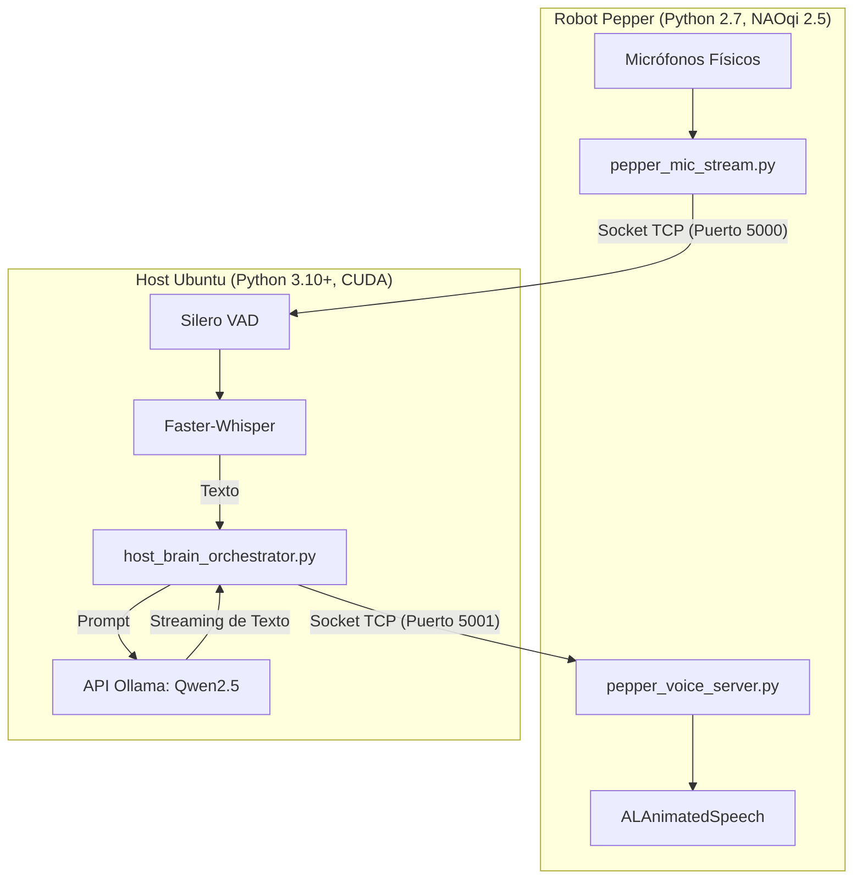

# 🤖 Pepper Remote Brain Architecture
> **Revitalizando a Pepper (NAOqi 2.5) con Inteligencia Artificial Moderna Distribuida (CUDA, Whisper & Qwen2.5)**


## 📡 Arquitectura del Sistema
El sistema delega todo el procesamiento cognitivo pesado a un Host local con aceleración CUDA, resolviendo las limitaciones de hardware del robot sin intervenir su vida autónoma (ALAutonomousLife). El Host y el Robot se comunican mediante Sockets TCP bidireccionales, gestionando micrófonos y síntesis de voz en paralelo con un robusto protocolo **Anti-Eco**.



## ⚙️ Requisitos del Sistema

**Hardware:**
* **Robot:** SoftBank Pepper v1.7.
* **Host PC:** Procesador moderno, 16GB RAM mínimo, GPU Nvidia RTX 3050 (o superior) para inferencia CUDA en tiempo real.
* **Red:** Conexión LAN WiFi o Ethernet estable entre el Host y el Robot.

**Software:**
* **Robot:** NAOqi OS 2.5, Python 2.7 nativo (no requiere paquetes pip externos).
* **Host PC:** Ubuntu 24.04, Python 3.10+, Ollama instalado como servicio de sistema.
* **Dependencias Host:** `faster-whisper`, `numpy`, `requests`.

## 📁 Estructura del Repositorio

```text
pepper_IA/
├── pepper_mic_stream.py        # [Robot] Cliente TCP que captura PCM 16kHz nativo y lo envía al Host en tiempo real.
├── pepper_voice_server.py      # [Robot] Servidor TCP que recibe oraciones parseadas y activa ALAnimatedSpeech.
├── host_brain_orchestrator.py  # [Host] Orquestador maestro que une Whisper, Ollama y el control bidireccional TCP.
├── orchestrator_mock.py        # [Host] Entorno de prueba local para validar la personalidad del LLM sin encender el robot.
└── spy_dialog.py               # [Robot] Herramienta de diagnóstico de eventos de memoria para ALDialog.
```

## 🛠️ Guía de Instalación y Setup

### Configuración en el Host (Ubuntu)
1. Instala Ollama en tu sistema y descarga el modelo LLM de ultrabaja latencia recomendado:
   ```bash
   ollama run qwen2.5:7b
   ```
2. Crea el entorno virtual e instala las dependencias de Machine Learning:
   ```bash
   python3 -m venv venv
   source venv/bin/activate
   pip install faster-whisper numpy requests
   ```

### Configuración en el Robot
Transfiere los scripts de red al robot utilizando SSH/SCP:
```bash
scp pepper_mic_stream.py pepper_voice_server.py nao@<IP_DE_PEPPER>:/home/nao/
```

## 🚀 Runbook (Orden de Ejecución Crítico)

Para evitar bloqueos de sockets por *Timeouts* y asegurar que la sincronización de puertos se levante limpiamente, sigue **estrictamente** este orden:

1. **Paso 1: Inicia la Boca de Pepper (En Pepper)**
   Abre una terminal SSH hacia el robot y levanta el servidor de escucha:
   ```bash
   python pepper_voice_server.py
   ```
2. **Paso 2: Inicia el Cerebro y Oídos (En Ubuntu Host)**
   Abre una terminal en tu entorno virtual y arranca el orquestador maestro pasándole la IP del robot como parámetro:
   ```bash
   source venv/bin/activate
   python3 host_brain_orchestrator.py <IP_DE_PEPPER>
   ```
3. **Paso 3: Inicia la Captura de Audio (En Pepper)**
   Abre una segunda terminal SSH hacia el robot y envía el audio hacia la IP de tu computadora Ubuntu:
   ```bash
   python pepper_mic_stream.py <IP_DEL_HOST_UBUNTU>
   ```

## 🔧 Troubleshooting (Solución de Problemas Frecuentes)

* **Problema:** La telemetría de audio se congela en el Host o NAOqi mata el proceso en el robot tras unos segundos.
  * **Causa:** `ALAudioDevice` es estricto en tiempo real. Si el callback `processRemote` se demora por cuellos de botella de red, NAOqi crashea el módulo. Adicionalmente, el motor nativo `ALDialog` puede acaparar el micrófono.
  * **Solución:** `pepper_mic_stream.py` ya lo resuelve implementando una `Queue.Queue` asíncrona para absorber la latencia TCP, y lanza un proceso de desuscripción forzada contra `ALDialog` en el pre-vuelo.
  
* **Problema:** El robot tartamudea al hablar, rompe el final de las oraciones o suena robótico.
  * **Causa:** Si la IA envía palabras individuales o chunks incompletos, el motor `ALAnimatedSpeech` no puede precalcular la prosodia.
  * **Solución:** `host_brain_orchestrator.py` acumula el stream del LLM y ejecuta el envío a través de red únicamente al encontrar un signo de puntuación definitivo (`.`, `!`, `?`, `\n`). Además, inyecta etiquetas de Nuance (`\vct=115\ \rspd=85\`) para bajar la velocidad general y obligar a Pepper a respetar las comas.

* **Problema:** El robot responde a sus propias palabras entrando en un "Eco Infinito".
  * **Causa:** Mientras Pepper habla físicamente, sus micrófonos graban el audio, se transcriben con Whisper y el LLM se responde a sí mismo.
  * **Solución:** El protocolo Sockets cuenta con sincronización de estado. El Host envía una cadena `__END__` cuando el LLM finaliza. El robot la recibe, y al terminar físicamente de mover la boca, devuelve un `ACK`. El Host espera este paquete y, al recibirlo, ejecuta un **Flush** de 8192 bytes en el socket de entrada para destruir el audio residual del robot antes de volver a escuchar al humano.
